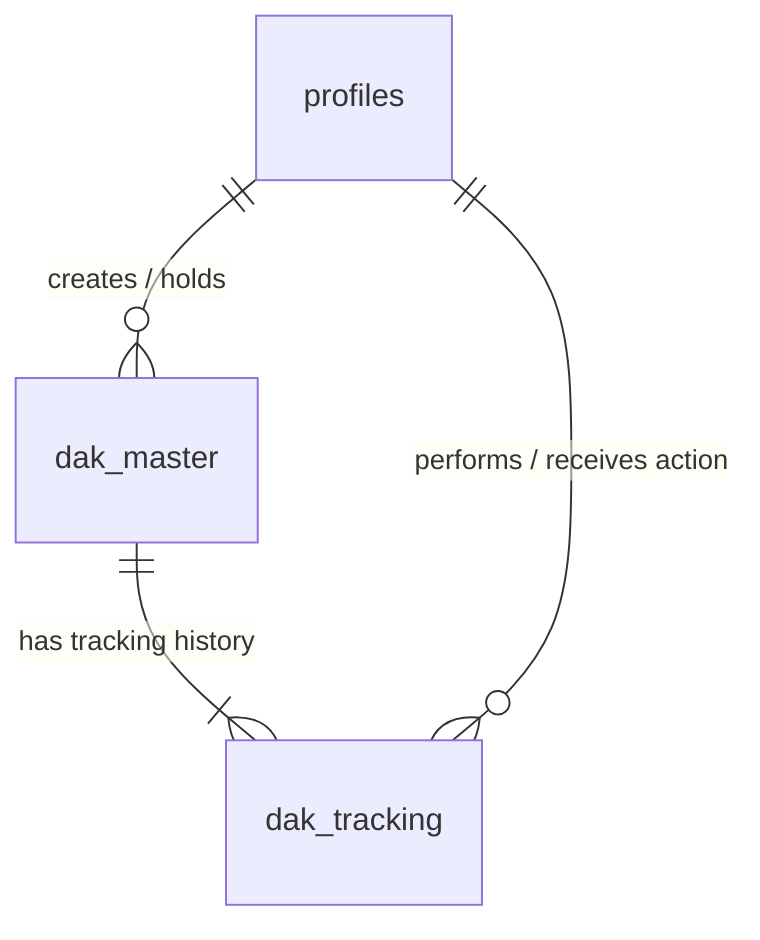
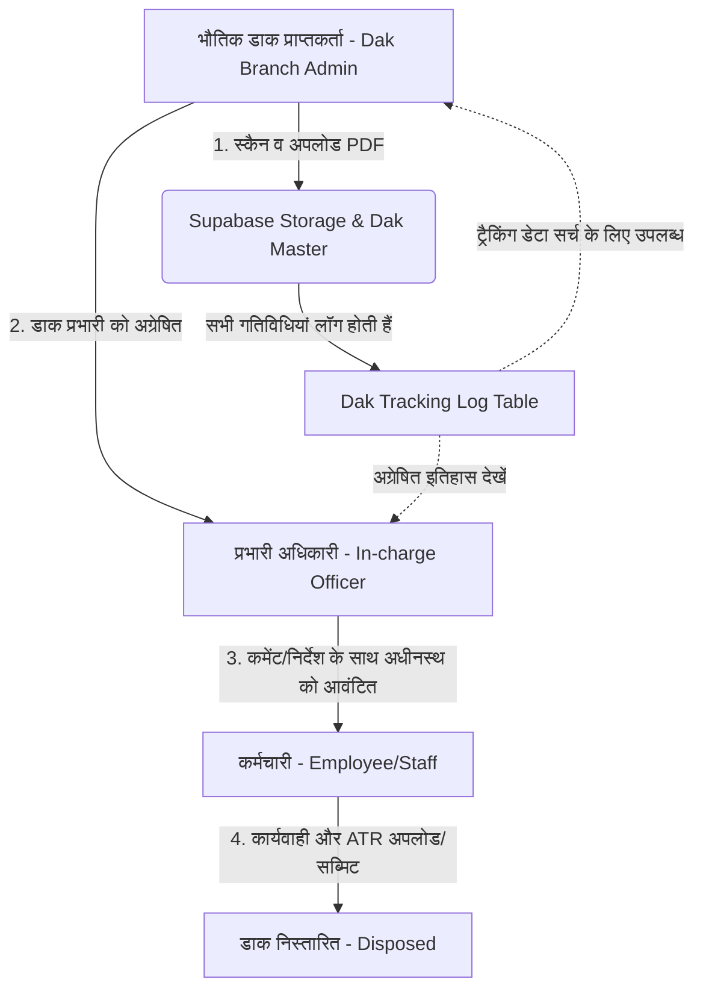

# डाक संचालन प्रणाली (Dak Management System) - डिज़ाइन ब्लूप्रिंट

यह दस्तावेज़ उत्तर प्रदेश पुलिस विभाग की **तकनीकी सेवायें शाखा** के लिए एक सुरक्षित, पारदर्शी और कुशल वेब-आधारित 'डाक संचालन प्रणाली' (Dak Management Portal) का विस्तृत टेक्निकल आर्किटेक्चर और डिज़ाइन ब्लूप्रिंट प्रदान करता है।

---

## 1. Technology Stack (तकनीकी स्टैक)

इस प्रोजेक्ट के लिए सबसे सुरक्षित, स्केलेबल और आधुनिक टेक स्टैक निम्नलिखित है:

| Layer | Technology | Reason for Selection |
| :--- | :--- | :--- |
| **Frontend** | **React.js + Vite** | तीव्र गति (Fast Performance), कंपोनेंट-बेस्ड आर्किटेक्चर, और सिंगल पेज एप्लीकेशन (SPA) के लिए सर्वश्रेष्ठ। |
| **Styling** | **Tailwind CSS** | रिस्पॉन्सिव डिज़ाइन, पुलिस पोर्टल के लिए प्रीमियम एवं साफ-सुथरा UI (Clean UI Layout)। |
| **Backend & DB** | **Supabase (PostgreSQL)** | ओपन-सोर्स फायरबेस विकल्प। इसमें रिलेशनल डेटाबेस (Postgres), सुरक्षित ऑथेंटिकेशन (Supabase Auth), फाइल स्टोरेज (Supabase Storage) और रियल-टाइम लिसनर्स की इन-बिल्ट सुविधा है। |
| **Security / RBAC** | **PostgreSQL RLS (Row Level Security)** | डेटाबेस स्तर पर ही नीतियों (Policies) द्वारा सुरक्षा सुनिश्चित की जाएगी ताकि कोई भी अनधिकृत यूज़र दूसरे का डेटा न देख सके। |
| **File Storage** | **Supabase Bucket Storage** | स्कैन की गई डाक (PDF) को एन्क्रिप्टेड और सुरक्षित तरीके से स्टोर करने के लिए। |

---

## 2. Database Schema (डेटाबेस स्कीमा)

हम PostgreSQL का उपयोग कर रहे हैं। यहाँ 3 मुख्य तालिकाएं (Tables) हैं: `profiles`, `dak_master`, और `dak_tracking`।



### SQL Schema Definition

```sql
-- 1. ENUMS (Custom Data Types)
CREATE TYPE user_role AS ENUM ('admin', 'in_charge', 'employee');
CREATE TYPE posting_level AS ENUM ('hq', 'zone', 'range', 'district');
CREATE TYPE dak_status AS ENUM ('pending_incharge', 'pending_employee', 'disposed');
CREATE TYPE action_type AS ENUM ('received', 'forwarded', 'disposed');

-- 2. PROFILES TABLE (Extends Supabase Auth.users)
CREATE TABLE profiles (
    id UUID REFERENCES auth.users(id) ON DELETE CASCADE PRIMARY KEY,
    name VARCHAR(255) NOT NULL,
    role user_role NOT NULL DEFAULT 'employee',
    designation VARCHAR(100) NOT NULL, -- e.g., 'Inspector', 'Sub-Inspector'
    posting_level posting_level NOT NULL, -- e.g., 'hq', 'zone'
    posting_name VARCHAR(255) NOT NULL, -- e.g., 'Technical Services HQ', 'Lucknow Zone'
    created_at TIMESTAMP WITH TIME ZONE DEFAULT TIMEZONE('utc'::text, NOW()) NOT NULL,
    updated_at TIMESTAMP WITH TIME ZONE DEFAULT TIMEZONE('utc'::text, NOW()) NOT NULL
);

-- 3. DAK MASTER TABLE (Main Dak Records)
CREATE TABLE dak_master (
    id UUID DEFAULT gen_random_uuid() PRIMARY KEY,
    ref_no VARCHAR(100) UNIQUE NOT NULL, -- e.g., 'DAK/2026/00001'
    sender_name VARCHAR(255) NOT NULL,
    sender_department VARCHAR(255) NOT NULL,
    subject VARCHAR(500) NOT NULL,
    description TEXT,
    file_url VARCHAR(1024) NOT NULL, -- Supabase Storage URL
    current_holder_id UUID REFERENCES profiles(id) ON DELETE SET NULL,
    created_by UUID REFERENCES profiles(id) ON DELETE SET NULL,
    status dak_status NOT NULL DEFAULT 'pending_incharge',
    created_at TIMESTAMP WITH TIME ZONE DEFAULT TIMEZONE('utc'::text, NOW()) NOT NULL,
    updated_at TIMESTAMP WITH TIME ZONE DEFAULT TIMEZONE('utc'::text, NOW()) NOT NULL
);

-- 4. DAK TRACKING TABLE (History/Log of every action)
CREATE TABLE dak_tracking (
    id UUID DEFAULT gen_random_uuid() PRIMARY KEY,
    dak_id UUID REFERENCES dak_master(id) ON DELETE CASCADE NOT NULL,
    from_user_id UUID REFERENCES profiles(id) ON DELETE SET NULL,
    to_user_id UUID REFERENCES profiles(id) ON DELETE SET NULL,
    action action_type NOT NULL,
    comments TEXT, -- Instructions from In-charge OR Action Taken Report (ATR) from Employee
    created_at TIMESTAMP WITH TIME ZONE DEFAULT TIMEZONE('utc'::text, NOW()) NOT NULL
);
```

---

## 3. System Architecture & Data Flow (डेटा फ्लो)

डाक संचालन का डेटा प्रवाह बहुत ही सरल और पदानुक्रमित (Hierarchical) है:



### प्रवाह विवरण (Workflow Details):
1. **डाक प्राप्ति और स्कैनिंग (Dak Branch - Admin):**
   * डाक शाखा भौतिक डाक प्राप्त कर उसे PDF फॉर्मेट में स्कैन करेगी।
   * पोर्टल पर प्रेषक (Sender) की जानकारी, विषय (Subject) भरकर फाइल अपलोड करेगी।
   * ड्रॉपडाउन से उपयुक्त 'प्रभारी अधिकारी' को चुनकर डाक सब्मिट करेगी।
2. **प्रभारी अधिकारी (In-charge Officer):**
   * अपने डैशबोर्ड पर "Received Mail" सेक्शन में नई डाक देखेगा।
   * डाक की PDF फाइल को सीधे ब्राउज़र में देख सकता है।
   * टिप्पणी/निर्देश लिखकर उसे संबंधित 'कर्मचारी' को अग्रेषित (Forward) करेगा।
3. **कर्मचारी (Employee/Staff):**
   * कर्मचारी को डैशबोर्ड पर प्राप्त डाक दिखाई देगी।
   * वह कार्यवाही पूरी करने के बाद "Action Taken Report (ATR)" दर्ज करेगा और डाक को "Disposed" मार्क करेगा।
4. **ट्रैकिंग और सर्च (Tracking & Search):**
   * `dak_tracking` टेबल हर कदम पर अपडेट होती है। डाक शाखा (Admin) किसी भी समय रेफरेंस नंबर से यह देख सकती है कि डाक इस समय किसके पास लंबित है।

---

## 4. API Endpoints (REST API Structure)

यद्यपि Supabase का क्लाइंट-साइड SDK सीधे डेटाबेस से बात कर सकता है, लेकिन आर्किटेक्चरल रूप से इन्हें निम्नलिखित REST API एंडपॉइंट्स या Supabase Edge Functions के रूप में परिभाषित किया जा सकता है:

### 1. डाक अपलोड (Upload Dak)
* **Endpoint:** `POST /api/dak`
* **Access:** Admin (Dak Branch) Only
* **Payload (Multipart Form-data):**
  ```json
  {
    "sender_name": "जनपद पुलिस मुख्यालय, कानपुर",
    "sender_department": "स्थापना शाखा",
    "subject": "आरक्षी स्थानांतरण सूची के संबंध में",
    "description": "स्थानांतरित आरक्षियों की सूची एवं उनके कार्यमुक्ति आदेश।",
    "file": "[PDF File Binary]",
    "to_user_id": "uuid-of-incharge-officer"
  }
  ```
* **Response (201 Created):**
  ```json
  {
    "success": true,
    "ref_no": "DAK/2026/00452",
    "message": "Dak registered and forwarded successfully."
  }
  ```

### 2. डाक अग्रेषण (Forward Dak)
* **Endpoint:** `POST /api/dak/forward`
* **Access:** In-charge Officer Only
* **Payload:**
  ```json
  {
    "dak_id": "uuid-of-dak",
    "to_user_id": "uuid-of-employee",
    "comments": "कृपया आवश्यक कार्यवाही कर 3 दिनों में आख्या प्रस्तुत करें।"
  }
  ```
* **Response (200 OK):**
  ```json
  {
    "success": true,
    "message": "Dak forwarded to employee."
  }
  ```

### 3. डाक निस्तारण (Dispose Dak)
* **Endpoint:** `POST /api/dak/dispose`
* **Access:** Employee Only
* **Payload:**
  ```json
  {
    "dak_id": "uuid-of-dak",
    "action_taken_report": "आदेशानुसार कार्यवाही पूर्ण कर ली गई है। सम्बंधित आरक्षियों को कार्यमुक्त कर दिया गया है।"
  }
  ```
* **Response (200 OK):**
  ```json
  {
    "success": true,
    "message": "Dak marked as disposed successfully."
  }
  ```

### 4. डाक ट्रैकिंग (Track Dak Lifecycle)
* **Endpoint:** `GET /api/dak/:id/track`
* **Access:** Authenticated Users (Role-based scope)
* **Response (200 OK):**
  ```json
  {
    "dak_id": "uuid-of-dak",
    "ref_no": "DAK/2026/00452",
    "current_status": "disposed",
    "lifecycle": [
      {
        "step": 1,
        "from": "डाक शाखा (Admin)",
        "to": "श्री के. पी. सिंह (प्रभारी अधिकारी)",
        "action": "received",
        "comments": "डाक प्राप्त एवं प्रविष्टि की गई।",
        "date": "2026-07-08T11:40:00Z"
      },
      {
        "step": 2,
        "from": "श्री के. पी. सिंह (प्रभारी अधिकारी)",
        "to": "अमित कुमार (मुख्य आरक्षी)",
        "action": "forwarded",
        "comments": "कृपया आवश्यक कार्यवाही कर 3 दिनों में आख्या प्रस्तुत करें।",
        "date": "2026-07-08T12:15:00Z"
      },
      {
        "step": 3,
        "from": "अमित कुमार (मुख्य आरक्षी)",
        "to": null,
        "action": "disposed",
        "comments": "आदेशानुसार कार्यवाही पूर्ण कर ली गई है। सम्बंधित आरक्षियों को कार्यमुक्त कर दिया गया है।",
        "date": "2026-07-09T10:30:00Z"
      }
    ]
  }
  ```

---

## 5. Security Measures (सुरक्षा उपाय)

पुलिस विभाग की संवेदनशीलता को देखते हुए सुरक्षा अत्यंत महत्वपूर्ण है:

### A. Row Level Security (RLS) Policies
Supabase (PostgreSQL) के RLS फीचर्स का उपयोग करके हम यह सुनिश्चित करेंगे कि कोई भी उपयोगकर्ता केवल वही डेटा देख सके जिसके लिए वह अधिकृत है।

1. **`profiles` Table Policy:**
   * **SELECT:** कोई भी प्रमाणित (Authenticated) यूज़र प्रोफाइल देख सकता है (ताकि वे डाक अग्रेषित करते समय अधिकारियों की सूची देख सकें)।
   * **UPDATE:** यूज़र केवल अपनी प्रोफाइल को ही अपडेट कर सकता है।

2. **`dak_master` Table Policy:**
   * **SELECT:**
     * `admin` भूमिका वाले यूज़र्स सभी डाक देख सकते हैं।
     * `in_charge` और `employee` केवल वही डाक देख सकते हैं जहाँ `current_holder_id` उनका अपना UUID हो, या वे उस डाक के ट्रैकिंग इतिहास (`dak_tracking`) में शामिल हों (जिससे वे पूर्व में उनके द्वारा देखी गई डाक की हिस्ट्री देख सकें)।
   * **INSERT/UPDATE:** केवल संबंधित भूमिकाएँ ही आवश्यक बदलाव कर सकती हैं (उदा. कर्मचारी केवल तब स्टेटस बदल सकता है जब डाक उसके पास हो)।

### B. Supabase Storage Security (फाइल सुरक्षा)
* स्कैन की गई पीडीएफ फाइलें सार्वजनिक (Public) बकेट में नहीं रखी जाएंगी।
* **Private Bucket:** डाक की फाइलों के लिए एक प्राइवेट स्टोरेज बकेट `dak-documents` बनाया जाएगा।
* **Signed URLs:** फाइलों को सीधे एक्सेस नहीं किया जा सकता। जब कोई अधिकृत यूज़र डाक देखने के लिए क्लिक करेगा, तब बैकएंड/सुपाबेस द्वारा एक समय-सीमित (e.g., 5 मिनट की वैधता वाला) **Signed URL** जनरेट किया जाएगा। इससे लिंक लीक होने पर भी कोई अनधिकृत व्यक्ति फाइल डाउनलोड नहीं कर पाएगा।

### C. Role-Based Access Control (RBAC) in Auth
* रजिस्ट्रेशन के समय उपयोगकर्ताओं की भूमिका (`role`) को डेटाबेस स्तर पर `user_role` एनम के माध्यम से नियंत्रित किया जाएगा।
* फ्रंटएंड (React/Next.js) में रूट गार्ड्स (Route Guards) लगाए जाएंगे, जो यूज़र की भूमिका के आधार पर विशिष्ट डैशबोर्ड्स (Admin, In-charge, Employee) पर जाने की अनुमति देंगे।

---

## 6. Proposed Folder Structure (प्रस्तावित कोड संरचना)

यदि हम इस परियोजना को **React (Vite) + Tailwind CSS + Supabase** के साथ शुरू करते हैं, तो इसका कोड ढांचा (Folder Structure) निम्नलिखित होगा:

```text
DMS/
├── public/                 # Static assets like logo, icons
├── src/
│   ├── assets/             # Images, styles, and global fonts
│   ├── components/         # Reusable UI components
│   │   ├── common/         # Navbar, Sidebar, Footer, Button, Input, Modal
│   │   ├── dashboard/      # Role-specific dashboard layouts and cards
│   │   └── tracking/       # Dak Tracking Timeline Component
│   ├── context/            # Global State Management (AuthContext)
│   ├── hooks/              # Custom hooks (e.g., useDak, useProfiles)
│   ├── layouts/            # AuthLayout, DashboardLayout
│   ├── pages/              # Main Pages
│   │   ├── Login.jsx       # Login Screen
│   │   ├── AdminDashboard.jsx    # Dak Branch / Admin Panel
│   │   ├── InchargeDashboard.jsx # In-charge Officer Panel
│   │   ├── EmployeeDashboard.jsx # Employee / Staff Panel
│   │   └── SearchTrack.jsx       # Public or admin search and tracking page
│   ├── services/           # Supabase Client and Database API helpers
│   │   ├── supabase.js     # Supabase Client Initialization
│   │   ├── dak.js          # Dak CRUD, forward, and dispose API methods
│   │   └── auth.js         # Authentication helpers (login, logout, getProfile)
│   ├── styles/
│   │   └── index.css       # Tailwind CSS configurations
│   ├── App.jsx             # React router configuration and main container
│   └── main.jsx            # React Entry Point
├── .env.example            # Environment variables placeholder
├── tailwind.config.js      # Tailwind CSS configurations
├── vite.config.js          # Vite configurations
└── package.json            # NPM dependencies (supabase-js, react-router-dom, etc.)
```
